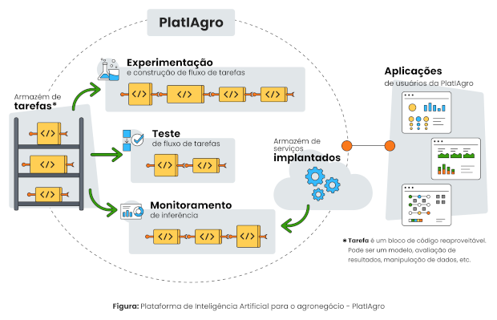

author: Fabio Beranizo Fontes Lopes
summary: Introdução à PlatIAgro
id: platiagro-introduction
categories: platiagro
environments: Web
status: Published
feedback link: https://github.com/platiagro/tutorials

# Introdução à PlatIAgro

## Visão Geral
Duration: 0:02:00

A Plataforma de IA para o agronegócio – **PlatIAgro** – tem como objetivo, a partir de tecnologias de machine learning, visão computacional e sistemas de diálogo, permitir o desenvolvimento de aplicações por diferentes atores da cadeia do agronegócio, como produtores, indústria e órgãos fiscalizadores. Sua espinha dorsal é composta por soluções de código aberto que são disponibilizadas em repositórios públicos para a comunidade.

### **O Que Você Vai Aprender**

* Como usar IA para prever falhas em máquinas agrícolas.
* Como construir um fluxo de experimentação utilizando as Tarefas da PlatIAgro.
* Como realizar a implantação de um fluxo de tarefas.
* Como conectar uma aplicação a modelos implantados na PlatIAgro.

### **Do Que Você Precisa Para Este Tutorial**

* Um ambiente com a PlatIAgro pronta para uso.

## Crie um Novo Projeto
Duration: 0:02:00

Para dar início a um projeto, clique no botão **“Novo Projeto”**, localizado acima da lista de projetos. 
Ao clicar no botão será aberto um formulário onde é possível informar um nome e descrição.

<!-- Video new-project -->

Positive
: Em um projeto é possível: **construir experimentos, avaliar resultados e realizar implantação de fluxos.**

### **Após confirmar a operação, você será direcionado à página do projeto.**

## Construa um Fluxo de Tarefas
Duration: 0:10:00

Após criar um novo projeto, será possível experimentar vários fluxos de tarefas, seja para o treinamento de modelos ou visualização de resultados. 
Posteriormente, será possível decidir qual deles seguirá para implantação.

### **Importar um Conjunto de Dados**

Negative
: Faça download do conjunto de dados **[Falha em Máquinas Agrícolas](https://raw.githubusercontent.com/platiagro/platiagro.github.io/codelabs/platiagro-introduction/datasets/FalhaEmMaquinasAgricolas.csv)**.

1. No painel central, selecione a tarefa **“Conjunto de Dados”**. Os detalhes da tarefa irão aparecer à direita.

1. Clique no botão **“Selecionar”** e escolha o arquivo **“FalhaMaquinasAgricolas.csv”**, obtido no passo anterior. 

1. Clique no botão **“Importar”** para importar o conjunto de dados.

1. Selecione o atributo alvo **“Falhará em breve”**.

<!-- Video import-dataset -->

### **Criar um Fluxo de Experimentação**
Selecione a tarefa **“Pre-Selection”** dentro do painel **“Engenharia de dados”**.

Positive
: Essa tarefa é importante pois tende a melhorar a acurácia dos modelos. A PlatIAgro já possui algumas tarefas nativas, como a **criação e seleção de atributos de forma inteligente e automática** para auxiliar o trabalho de engenharia de dados.

<!-- Video add-task-pre-selection -->

Selecione a tarefa **“AutoML Classifier”** dentro do painel **“Treinamento”**.

Positive
: A PlatIAgro possui diversas tarefas nativas para classificação, regressão e agrupamento. Alguns exemplos são:  **- Redes Neurais**  **- Floresta Aleatória**  **- Regressões**  **- AutoML**

<!-- Video add-task-automl-classifier -->

### **Executar Fluxo de Experimentação**

Clique no botão **“Executar”**, a seguinte mensagem será exibida: “Executando o fluxo”

Quando a execução do fluxo for concluída com sucesso, **as tarefas ficarão destacadas em verde**.

<!-- Video run-training -->

### **Visualizar Resultados**

Algumas tarefas criam gráficos e tabelas para melhor visualização dos resultados do experimento.

Clique na tarefa AutoML Classifier, e no painel à direita clique no botão **“Visualizar resultado”** para ver a [matriz de confusão](https://en.wikipedia.org/wiki/Confusion_matrix) para o modelo treinado.

<!-- Video view-results -->

### **Abrir notebook Jupyter**

A PlatIAgro utiliza [Jupyter notebooks](https://jupyter.org/) para facilitar a criação das tarefas. De fato, cada passo do fluxo de experimentação é um notebook.

Ainda no painel da tarefa AutoML Classifier, clique no botão **“Abrir notebook no Jupyter”**.

Positive
: Aproveite o Jupyter notebook para descobrir o que acontece dentro do AutoML Classifier.

<!-- Video view-notebook-outputs -->

### **Feche a janela do Jupyter para voltar à PlatIAgro.**

Negative
: Após a execução do experimento **não são permitidas alterações no fluxo**. Para testar outros fluxos crie um novo experimento com o botão **“+”** localizado nas abas do painel principal.

## Faça a Implantação do Fluxo de Experimentação
Duration: 0:15:00

Para que aplicações utilizem facilmente os modelos gerados na experimentação, a PlatIAgro permite a implantação de fluxos em um **serviço REST**.

No painel do experimento, clique no botão **“Implantar”**.

### **Você será direcionado à página de fluxos implantados.**

Negative
: Leva aproximadamente 10 minutos para que um serviço REST esteja disponível para uso.

<!-- Video deployment -->

### **Conectar uma Aplicação a um Modelo Implantado**

Vamos conectar um dashboard ao modelo implantado.

1. Na tabela de fluxos implantados clique no botão **Copiar**, próximo a URL do serviço.

1. Acesse a [aplicação dashboard](https://platiagro.github.io/platiagro/machine-failure/)

1. Clique em **“Informar URL”**, preencha a URL copiada e clique em OK.

### **Aguarde uns instantes, e então você verá as probabilidades de falha retornadas pelo modelo.**

<!-- Video application -->

### **Parabéns! Você utilizou a PlatIAgro para construir um fluxo de machine learning de ponta-a-ponta.**

### **Próximos Passos**

* Crie uma Tarefa na PlatIAgro
* Conheça as Tarefas Nativas da PlatIAgro
