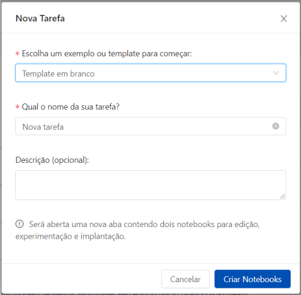

author: Fabio Beranizo Fontes Lopes
summary: Criação de Tarefas
id: platiagro-tasks
categories: platiagro
environments: Web
status: Published
feedback link: https://github.com/platiagro/tutorials

# Criação de Tarefas

## Introdução
Duration: 0:00:30

Para criar uma tarefa, o usuário deverá clicar no menu Tarefas e depois no botão "+ Nova Tarefa".

**Descrição:** Na página "Tarefas”, será apresentada uma lista com todas as tarefas existentes. As informações das tarefas estarão divididas em quatro colunas: Nome da Tarefa, Descrição e Ação.
Nesta tela serão apresentadas as tarefas da plataforma e dos usuários.

## Seleção da nova tarefa
Duration: 0:01:30

A plataforma oferece uma série de exemplos para iniciar nova tarefa. Ela também oferece uma opção em branco.

**Descrição:** A janela “Nova Tarefa”, possui dois campos obrigatórios e um opcional. 
O primeiro campo obrigatório é o tipo do exemplo ou "template" inicial. A plataforma oferece grande quantidade de exemplos envolvendo classificação, regressão, seleção de "features" e muitos outros.
O segundo campo obrigatório é o nome da tarefa. O nome da tarefa será mostrado junto com os outros nomes então escolha um nome que facilite encontrar sua tarefa no futuro.
O campo opcional é uma descrição de sua tarefa. Se não precisar descrever ou registrar algum detalhe importante pode ficar em branco.
O botão "Cancelar" fecha esta janela e volta para a anterior sem gravar nada.
O botão "Criar Notebooks" abre nova aba no seu navegador com três divisões que serão comentadas na próxima seção deste tutorial. 

## Criação de Tarefas em Branco

Explicar ícones alto a esquerda
Explicar ícones barra lateral esquerda
Comentar sobre as abas dos notebooks e launcher

Sugestões de pontos de melhorias e esclarecimentos para criação de novas tarefas em branco.

1) Na criação de parâmetros (input) falta explicação ou advertência sobre regras para nome de variável no padrão Python.
2) Precisa deixar claro que o conjunto de dados (dataset) a ser usado precisa ter método "read()", exemplo pandas.DataFrame
3) Recomendo esclarecer que precisa de CNTRL-ENTER para executar uma célula e que o triângulo no alto da tela (Run...) não faz nada.
4) Recomendo esclarecer que os inputs (parâmetros de entrada) são informados em janela lateral na plataforma
5) Recomendo esclarecer que se o código for grande é melhor criar classes e importar no componente com "from file import classes, métodos" 
6) Para importar classes e métodos no componente precisa carregar o arquivo .py na pasta do componente
7) Passos que usei para levar arquivos até a pasta do componente:
   a) encontrar a URL do arquivo de origem no github ou equivalente
   b) encontrar pasta destino do arquivo de testes (!pwd no Notebbok)
      Obs:1: Jupyter Notebook mostra nomes das pastas em uma aba
	  Obs.2: Jupyter Notebook em outra aba abre terminal (tela preta)
	  Obs.3: Tem um ícone do alto da tela que parece um monte de discos empilhados que deveria fazer isso. Procurei os arqs que enviei mas não encontrei	  
   c) executar wget na pasta de destino no terminal. Exemplo:
      wget https://github.com/platiagro/GA/blob/master/large_harvest/large_harvest/large_harvest_5_com_15.csv   
8) Mostrar resultados em duas formas:
   a) em forma de tabela usando dataframe Pandas. Renderiza tabela com matplotlib
   b) ???
   
8) Implantação (segundo Fábio, não é obrigatório)
   método predict() precisa de pelo menos 3 parâmetros (self, X: np.ndarray, feature_names: Iterable[str], meta: Dict = None) 
   Pode deixar só o Experient
   mas não pode usar plt.show()
   Precisa terminar com: 
      save_figure(figure=plt.gcf())
      plt.clf()

