author: Fabio Beranizo Fontes Lopes
summary: Criação de Tarefas
id: platiagro-tasks
categories: platiagro
environments: Web
status: Published
feedback link: https://github.com/platiagro/tutorials

# Criação de Tarefas

## Introdução
Duration: 0:00:30

Para criar uma tarefa, o usuário deverá clicar no menu Tarefas e depois no botão 

**Descrição:** Na página "Tarefas”, será apresentada uma lista com todas as tarefas existentes. As informações das tarefas estarão divididas em três colunas: Nome da Tarefa, Descrição e Ação.
Nesta tela serão apresentadas as tarefas da plataforma e dos usuários.

## Seleção da nova tarefa
Duration: 0:01:30

A plataforma oferece uma série de exemplos para iniciar nova tarefa. Ela também oferece uma opção em branco.

**Descrição:** A janela “Nova Tarefa”, possui dois campos obrigatórios (assinalados com asterisco) e um opcional. 
O primeiro campo obrigatório é o tipo do exemplo ou "template" inicial. A plataforma oferece grande quantidade de exemplos envolvendo classificação, regressão, seleção de "features" e muitos outros.
O segundo campo obrigatório é o nome da tarefa. O nome da tarefa será mostrado junto com os outros nomes então escolha um nome que facilite encontrar sua tarefa no futuro.
O campo opcional é uma descrição de sua tarefa. Se não precisar descrever ou registrar algum detalhe importante pode ficar em branco.
O botão "Cancelar" fecha esta janela e volta para a anterior sem gravar nada.
O botão "Criar Notebooks" abre nova aba no seu navegador com três divisões que serão comentadas na próxima seção deste tutorial. 

## Criação de Tarefas em Branco
Duration: 0:04:00

Após selecionar e preencher os campos necessários a plataforma abre nova aba com as divisões Experiment.jpynb e Deployment.jpynb.

**Descrição:** A aba “Nova Tarefa”, possui algumas divisões criadas para orientar a elaboração da tarefa que serão comentados em outra seção.
Esta aba é criada com as divisões Experiment.jpynb e Deployment.jpynb. Também pode ser criada outra seção para Terminal onde podem ser executados comandos do Unix/Linux.
Nesta aba também podem ser visualizados os artefatos da tarefa e a localização destes artefatos no servidor. 
   Obs.1: o sinal de adição  no menu superior cria mais uma célula para seus códigos
   Obs.2: o ícone com a tesoura  remove a célula selecionada
   Obs.3: use CONTRL-ENTER para executar a célula selecionada porque o triângulo no alto da tela (Run...) não faz nada
   Obs.4: o ícone  serve para inserir novo parâmetro ("input")
   

**Descrição:** A janela “Add Parameter”, possui alguns campos sobre o novo parâmetro.
O campo "Variable name" deve ser preenchido levando em consideração as regras para nomes de variáveis em Python.
O campo "Label" deve ser preenchido com o nome que vai aparecer na área de parâmetros da plataforma que abre em uma aba lateral.

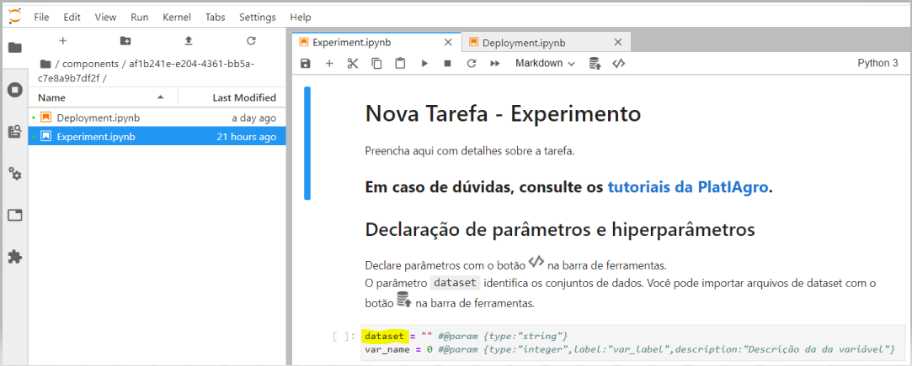

Na seção **Declaração de parâmetros e hiperparâmetros** é importante ressaltar que um dataset deve ter o método read(), como um dataframe Pandas.

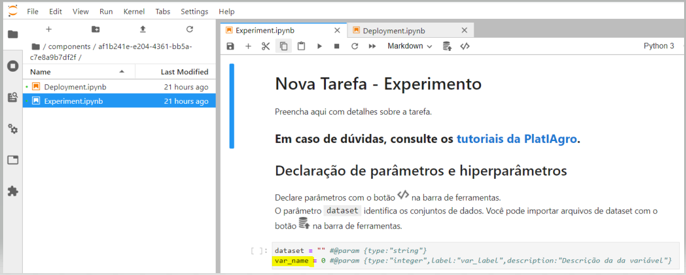

Neste exemplo foi criado um parâmetro (input) que aparece no Experiment.jpynb como "var_name" e aparece na aba lateral com a identificação "var_label". 

O ícone  na parte de baixo da lateral esquerda da tela serve para exibir os principais artefatos da tarefa: Experiment.jpynb e Deployment.jpynb

## Mostrar Terminal de Comandos Unix/Linux
Duration: 0:01:00

O ícone  na parte de cima da lateral esquerda serve para exibir um navegador de arquivos que mostra todos os artefatos da tarefa e sua localização no servidor

O ícone com sinal de adição  no menu superior perto da pasta preta serve para abrir o ícone para o "Terminal de comandos" e outras funcionalidades 

Neste exemplo foram usados alguns comandos para verificar em que local do servidor estão localizados os arquivos desta tarefa.

O ícone  serve para criar novas pastas na pasta atual.
O ícone   serve para fazer upload de arquivos da máquina do usuário para a pasta do projeto. É importante ressaltar que esta pasta é temporária e os arquivos carregados nesta pasta deverão ser carregados novamente para futuras pastas deta tarefa.
A maneira de fazer com que os arquivos necessários sejam copiados automaticamente para esta pasta é via o comando wget.
Exemplo "wget https://raw.githubusercontent.com/platiagro/.../nome_arquivo.csv"

## Importar Classes e Métodos
Duration: 0:01:00

Se o código for grande é melhor criar classes e importar no componente com "from file import classes, métodos" 
Para importar classes e métodos no componente primeiro precisa carregar o arquivo .py para a pasta do componente

Passos para levar arquivos até a pasta do componente:
   a) encontrar a URL do arquivo de origem no github ou equivalente
   b) executar wget em uma céula do Experiment. Exemplo:
      !wget https://github.com/platiagro/.../nome_arquivo.py

A tabela será redimensionada em função do tamanho do dataframe (df)

	  
## Mostrar Resultados Aba Lateral
Duration: 0:01:00
	  
Mostrar resultados em forma de tabela renderizada usando dataframe Pandas e Matplotlib.
   Obs.1: Não pode usar plt.show() porque ele limpa o objeto e depois não aparece nada na aba lateral de resultados
          Precisa terminar com: 
             save_figure(figure=plt.gcf())

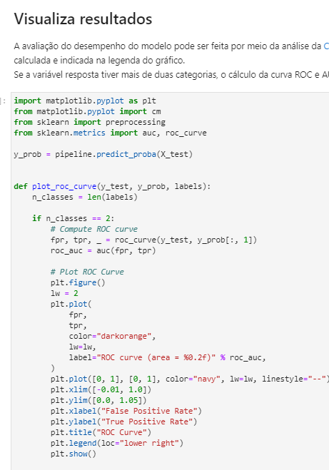

Se tudo correu bem então a tabela renderizada aparece na aba lateral da plataforma.

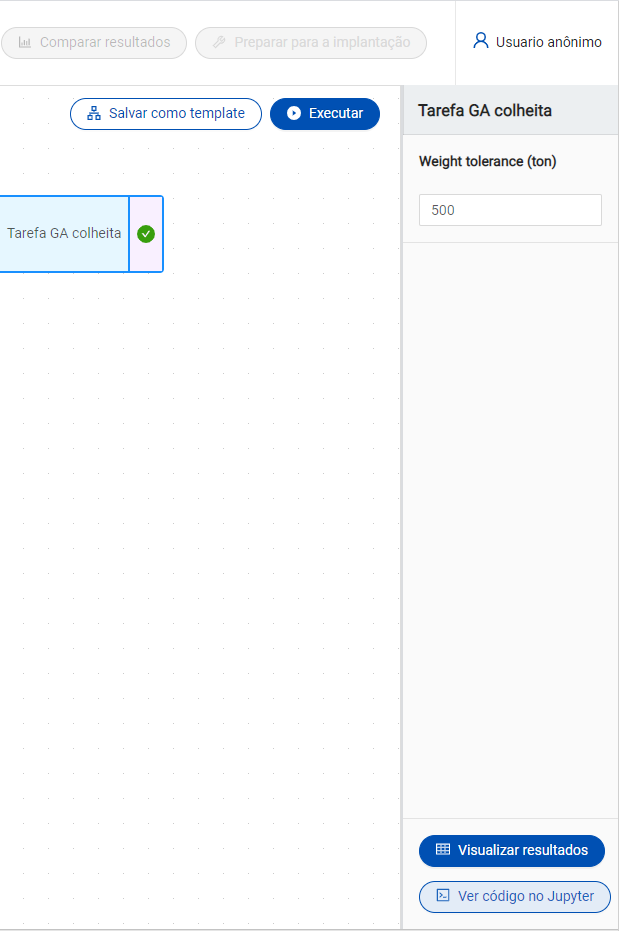

A linha "fig, ax = plt.subplots(figsize=(col, 0.4\*lin))" dimensiona a tabela em função do tamanho do dataframe, ajustando o tamanho das linhas e das colunas.
Após clicar no ícone  será aberta nova janela com a tabela de resultados.
A figura a seguir mostra um exemplo de uma tabela com apenas 5 colunas.

A figura a seguir mostra outra tabela com 17 colunas redimensionada para caber na tela.

## Aba Deployment
Duration: 0:02:00

A aba **Deployment** armazena o código necessário para a plataforma executar no servidor o modelo que foi criado na aba Experiment. 
O modelo deve ser importado e encapsulado na classe Model então esta classe precisa implementar o método "predict()".
A primeira seção desta aba serve para **identificação** da atividade, do autor e de seus principais objetivos.
Recomenda-se que sejam registrados o nome do autor e a data de criação.

A segunda seção **define a classe Model** que precisa implementar o método "predict()" para ser executado pelo servidor.
Neste exemplo o método "predict()" apenas mostra o parâmetro recebido e retorna este parâmetro para a interface gráfica.
As capturas de tela da interface gráfica serão mostradas no final deste tutorial porém a aba Deploymente também pode ser usada para conferir o resultado.

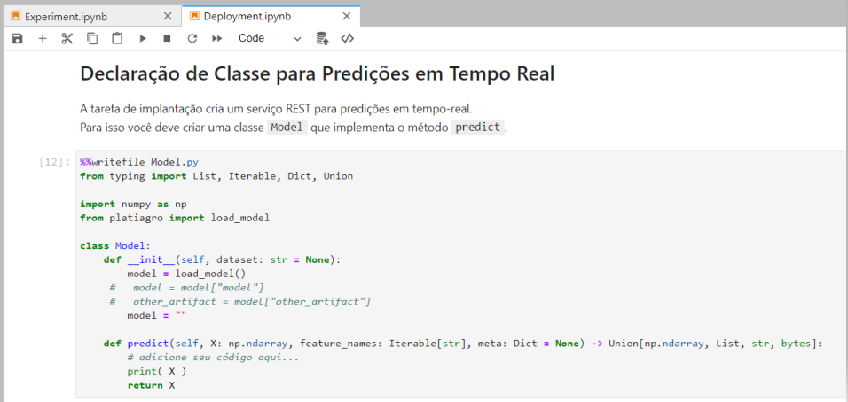

Note que a classe modelo deve retornar uma lista então talvez seja necessário acrescentar o método class_names().
Outro ajuste importante para modelos regressores é o retorno convertido para um array numpy.

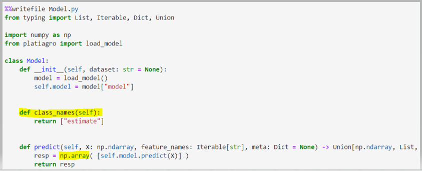

A seção **Teste do serviço REST** orienta como o pesquisador pode testar o resultado da execução de seu modelo.
Ela ajuda a criar um arquivo com um objeto json (JavaScipt Object Notation) para ser enviado ao seu modelo via protocolo REST.

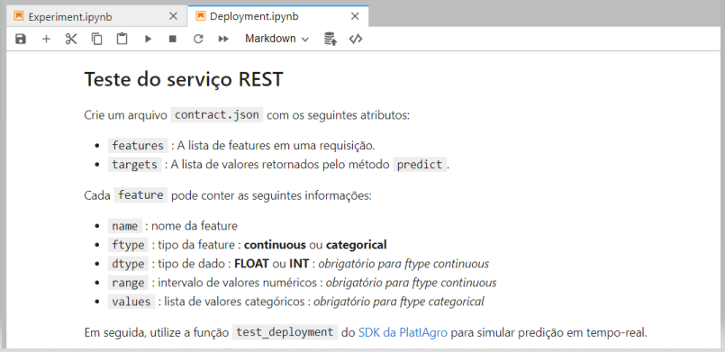

É importante ressaltar que o valor enviado ao modelo será sorteado de um intervalo que deve ser especificado na área **"range"** do objeto json.

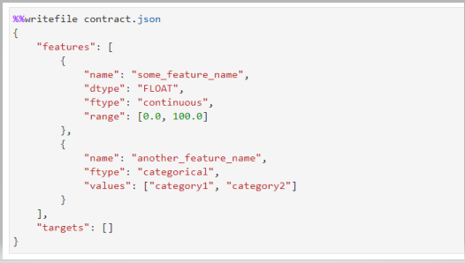

Se o modelo for do tipo Regressor então o arquivo json precisa ser ajustado.
Neste exemplo o modelo espera um arquio com duas colunas contendo valores numéricos.
Por isto a coluna "p0" tem o range [5.0, 5.0] e a coluna "p1" tem o range [6.0, 6.0], assim a plataforma vai sortear um valor entre 5 e 5 para a primeira coluna e um valor entre 6 e 6 para a segunda coluna.

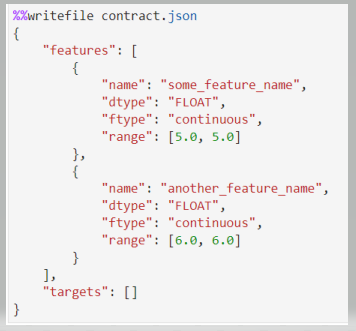

**test_deployment("contact.json")**
A última parte desta aba se encarrega de enviar o objeto json que foi gravado no arquivo contact.json usando o método test_deployment("contact.json")

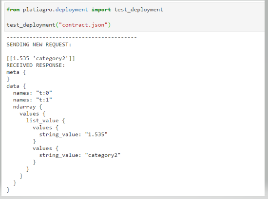

**Resultado do teste na aba Deployment**
O objeto json é exibido para o pesquisador conferir se os resultados estão de acordo com o esperado.

## Implantação e logs
Duration: 0:02:00

Cada projeto pode ter vários experimentos, porém apenas um deles será implantado.
Espera-se que os experimentos sejam criados e explorados até que o pesquisador se decida pela implantação de um deles para execução em tempo real no servidor.

Depois de criada a atividade desejada, ela deve ser **executada** para permitir sua implantação.
Se ocorrer algum erro durante sua execução o botão de implantação fica bloqueado.

O botão **Implantação** somente será liberado após uma execução completa da atividade sem nenhum erro.
É importante lembrar que este botão será liberado somente uma vez para cada projeto.
Caso dois ou mais experimentos apresentem bons resultados então o pesquisador deve considerar a possibilidade de criar novos projetos para eles.

A janela de **Experimentos Implantados** mostra os experimentos implantados pelo pesquisador.
A coluna "Status" apresenta a situação atual do experimento. O experimento deve ter o status "Succeeded" para poder ser executado.
A coluna "Nome" apresenta o nome do experimento implantado. 
   É importante ressaltar que este nome é composto pelo nome do projeto seguido pelo nome do experimento selecionado.
A coluna "URL" contém a url do experimento implantado. Ela pode ser usada em um terminal de comandos Unix/Linux.
A coluna "Data de Criação" contém a data e a hora da implantação do experimento.
A coluna "Ação" contém três opções:
   **"Deletar"** (apagar) o experimento
   **"Testar Inferência"** para executar o experimento enviando um arquivo CSV para o modelo.
   **"Logs"** para visualizar a mensagens do modelo em execução.
   
A ação **Testar Inferência** apresenta em uma janela o resultado recebido da execução do modelo no servidor.
O título desta janela é **Predições**

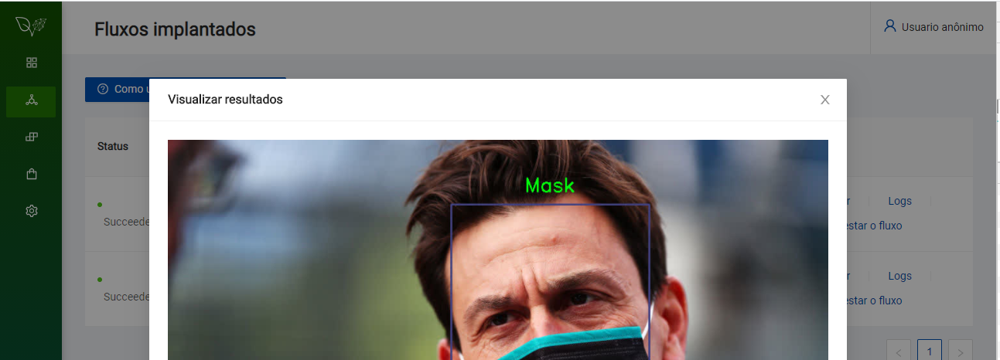

A ação **Logs** exibe uma janela para logs. 
Como a quantidade de mensagens de log costuma ser grande esta janela possui paginação.
Note que as mensagens mais recentes ficam no fim da lista.  

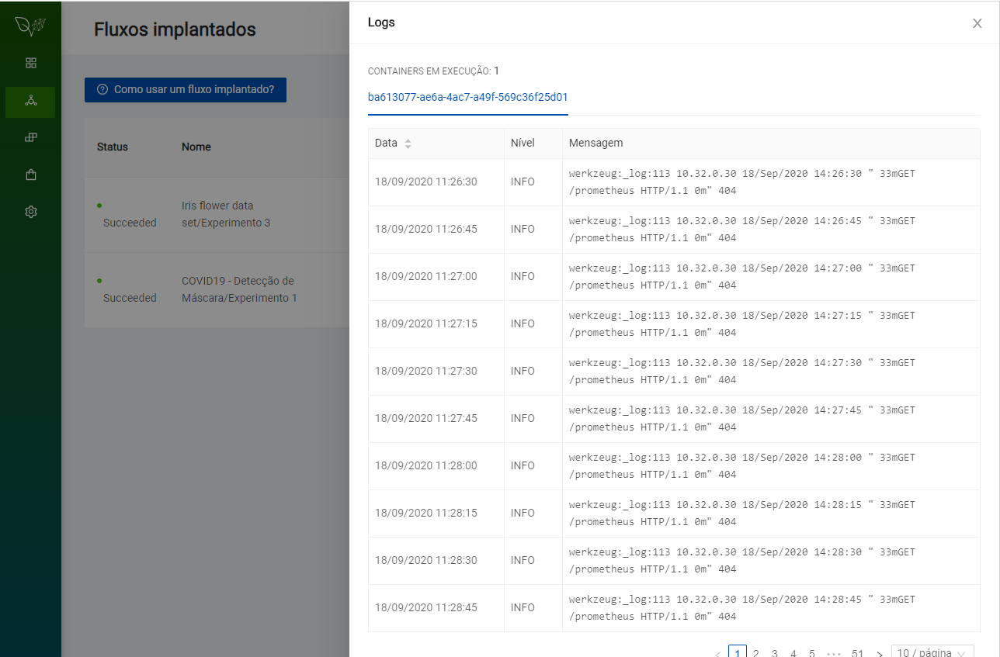
